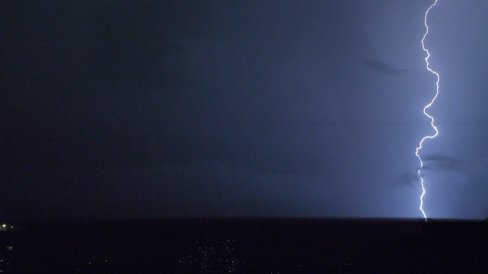
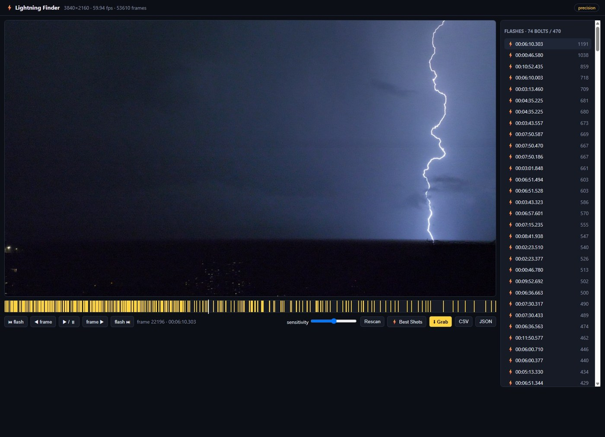

# ⚡ Lightning Finder

> Find the exact *frames* where lightning strikes in a storm video — and grab them at full quality.



Point it at a long, dark storm recording and it does three things most "lightning
detector" scripts don't:

1. **Finds every flash** by scanning brightness — even single-frame ones.
2. **Finds the _bolt_, not the glow.** The brightest frame is usually the sky
   lighting up a frame or two _after_ the strike. Lightning Finder scores each
   flash for an actual lightning _channel_ — a thin, vertical line in the sky —
   and points you to the real thing.
3. **Extracts that exact frame at the video's native resolution**, losslessly —
   not a screenshot.

It runs locally in your browser. No cloud, nothing uploaded.



## Features

- 🔦 **Flash detection** — a brightness-spike scan that catches even 1-frame
  flashes, ignores slow brightness drift (dawn, exposure changes), and groups a
  flickering strike into a single event.
- ⚡ **Best Shots (bolt detection)** — temporal-differencing computer vision that
  cancels the static scene (buildings, city lights, the horizon, even camera
  shake) and finds the real lightning channel. It ranks your flashes by channel
  strength and flags the ones that are only diffuse glow.
- 🎯 **Frame-precise review** — a browser scrubber with a timeline of flash
  markers; step frame-by-frame in a "precision mode" that shows the exact decoded
  frame, so what you see is exactly what you grab.
- 💎 **Full-quality grab** — saves the exact frame at native resolution as a
  lossless PNG.
- 📄 **Export** — flash timestamps to CSV / JSON.
- 🚀 **Handles big 4K files** — frame stepping uses a fast preview with
  background prefetch; the heavy scans are cached so you only pay once.

## How it works

Lightning Finder combines two complementary signals.

**1. Brightness — _when_ did a flash happen?**
It decodes every frame (downscaled), measures brightness, and flags sudden spikes
above a short rolling baseline. Keying off a *rise* rather than an absolute level
means gradual changes (sunrise, auto-exposure) are ignored while real flashes pop.

**2. Bolt structure — _where_ is the actual strike?**
The brightest frame is usually the sky *glow*, not the channel — and many
"flashes" are diffuse intracloud lightning with no visible bolt at all. So
**Best Shots** subtracts a per-pixel baseline of each flash window, which cancels
everything static (buildings, city lights, the horizon, most camera shake), and
then looks in the sky for a tall, thin, vertical/diagonal bright line: a lightning
channel. It re-points each flash to the frame where that channel is strongest and
tells you which flashes are only glow.

On one real 15-minute 4K storm clip, this surfaced **74 real bolts out of 470
detected flashes** — so instead of scrubbing hundreds of mostly-empty flashes,
you get a ranked shortlist of the keepers.

## Install

Requires **Python 3.10+**. (FFmpeg comes bundled with PyAV's wheels on most
platforms, so there's usually nothing else to install.)

```bash
git clone https://github.com/end1989/lightning-finder.git
cd lightning-finder
pip install -r requirements.txt
```

## Run

```bash
python app.py path/to/your_storm.mp4
```

Your browser opens at <http://127.0.0.1:8000>. The first open scans the video for
flashes (progress prints in the terminal) and caches the result next to the file,
so reopening — and rescanning — is instant.

## Use

- **Sidebar** lists detected flashes — click one to jump. `Shift+←/→` jumps flash
  to flash.
- **`←` / `→`** step one frame (this enters *precision mode* = exact decoded
  frames).
- **`,` / `.`** nudge ±0.1 s · **`Space`** play/pause.
- **`G`** grabs the current frame to `output/<video>/` as a lossless,
  native-resolution PNG.
- **`C` / `X`** confirm / reject the current flash.
- **⚡ Best Shots** ranks flashes by lightning-channel strength and re-points each
  to its real bolt frame (a few minutes the first time, then cached). Click a ⚡
  entry to land right on the strike, then `G` to grab it.
- **Sensitivity** slider + **Rescan** to tune how many flashes are detected.
- **CSV / JSON** export the flash timestamps.

## Tech

Python · [FastAPI](https://fastapi.tiangolo.com/) · [PyAV](https://pyav.org/)
(frame-accurate decode + native-resolution extraction) ·
[OpenCV](https://opencv.org/) (bolt detection) · NumPy · Pillow · a
dependency-free vanilla-JS frontend. No build step.

## Tests

```bash
python generate_test_clip.py test_clip.mp4   # a synthetic clip with known flashes
pytest -v
```

The synthetic clip injects flashes (including single-frame and flicker) plus a
slow brightness drift as a decoy, so detection is verified deterministically
without needing real footage.

## Limitations & roadmap

- **Camera shake** slightly muddies the bolt differencing (a shifted building edge
  can read as a faint "line"). Motion-stabilised differencing would tighten this.
- Best Shots decodes real frames, so it's a one-time multi-minute pass on long 4K
  clips (then cached).
- Also planned: multi-frame stacking for even cleaner shots, and batch processing
  across many videos.

## License

[MIT](LICENSE) — use it, modify it, ship it. Just keep the notice.
